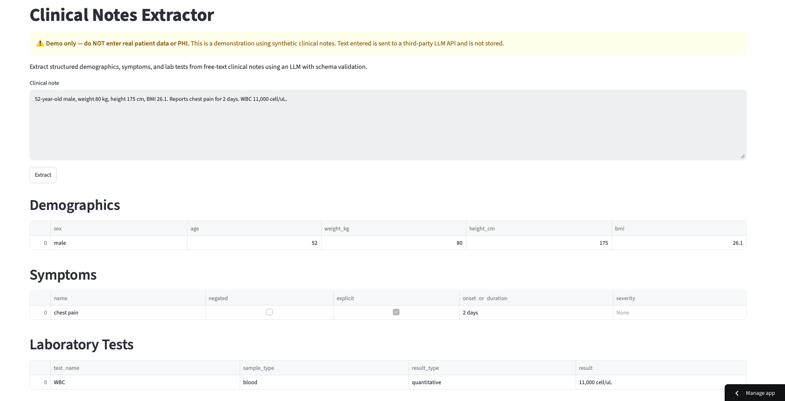

# Clinical Notes Extractor

Extracts structured patient information from unstructured clinical notes using an LLM (Claude), with schema validation, structured error handling, and unit-tested extraction logic — so the output can be trusted rather than assumed correct.

## 🔗 Live Demo

**[Try it here →](https://clinical-notes-extractor-gac5gsqdaeyssdarf3n2jn.streamlit.app)** — paste a clinical note and see structured demographics, symptoms, and lab tests extracted live.



> ⚠️ **Demo only — do not enter real patient data (PHI).** The demo uses synthetic clinical notes; text entered is sent to a third-party LLM API and is not stored.

## Goal

Clinical notes are written as free text — abbreviations, narrative prose, values buried in sentences, fields simply omitted. This project turns that unstructured text into **structured, validated data** that downstream systems can actually use.

The target categories are:

- **Demographics** — sex, age, weight, height, BMI *(implemented)*
- **Symptoms** — including negated ("denies chest pain") and implicit findings *(implemented)*
- **Lab tests** — test name, sample type, result type, and result, across specimen types (blood, urine, synovial fluid, CSF, etc.) *(implemented)*
- **Comorbidities** — active, historical, and family history *(planned)*
- **Medications** — name, dose, route, frequency *(planned)*

Every field not stated in the note is returned as null rather than fabricated.

## Why this is hard

An LLM can read the text, but its output is unreliable: it may return malformed JSON, hallucinate values, or produce the wrong type. This project treats the LLM as an untrusted component and wraps it in layers that catch those failures:

- **Schema validation** (Pydantic) rejects output that doesn't match the expected types — including constrained fields (e.g. `result_type` must be exactly `quantitative` or `qualitative`).
- **Structured error capture** records the failure stage (`json_parse` vs `validation`) and the raw model response, so failures are analyzable instead of lost.
- **A swappable client seam** lets the same pipeline run against the real API or a stand-in for testing, with no other code changes.
- **Unit tests** cover the extraction logic (100% line coverage), using a fake client to exercise success and failure paths without API calls.

## What it extracts

**Demographics** (one record per note):

| Field | Type | Notes |
|---|---|---|
| `sex` | string | "male" / "female", or null if not stated |
| `age` | number | in years; may be fractional for infants (e.g. 0.5 for a 6-month-old) |
| `weight_kg` | number | kilograms |
| `height_cm` | number | centimeters |
| `bmi` | number | body mass index |

**Symptoms** (a list per note): name, negated (e.g. "denies chest pain"), explicit vs. inferred, onset/duration, and severity.

**Lab tests** (a list per note): test name, sample type (inferred where possible — blood, urine, synovial fluid, CSF, etc.), result type (quantitative/qualitative), and the result value.

## Prerequisites

- **Python 3.12+** — developed with Python 3.12.13.
- **Poetry** — for dependency management (developed with Poetry 2.4).
- **An Anthropic API key** — the pipeline calls the Claude API. Get one from [console.anthropic.com](https://console.anthropic.com).

### Installing the tools

**Poetry** — install using the [official installer](https://python-poetry.org/docs/#installation).
Do **not** use `pip install poetry`: Poetry manages its own dependencies and should stay
isolated from your project environments, or the two can conflict.

**Python 3.12** — [pyenv](https://github.com/pyenv/pyenv#installation) is recommended for
managing the Python version. On macOS:

```bash
brew install pyenv
pyenv install 3.12.13
pyenv local 3.12.13
```

On Windows or Linux, see the [pyenv installation guide](https://github.com/pyenv/pyenv#installation).

## Setup

1. **Clone the repository:**
   ```bash
   git clone https://github.com/pearlparanjape/clinical-notes-extractor.git
   cd clinical-notes-extractor
   ```

2. **Install dependencies:**
   ```bash
   make install
   ```
   (This runs `poetry install`, which creates a virtual environment and installs everything.)

3. **Add your API key.** Create a file named `.env` in the project root:
   ```
   ANTHROPIC_API_KEY=sk-ant-your-key-here
   ```
   This file is gitignored and must never be committed.

## Usage

### Run the pipeline (batch extraction)
```bash
PYTHONPATH=. poetry run python -m src.pipeline
```
This loads a sample of clinical notes, extracts all categories from each, and writes four CSVs to `data/`:

- `original.csv` — the input notes
- `demographics.csv` — one row per note (wide)
- `symptoms.csv` — one row per symptom, keyed by `note_id` (long)
- `lab_tests.csv` — one row per lab test, keyed by `note_id` (long)

Demographics is one-to-one with each note, so it's stored wide; symptoms and lab tests are one-to-many, so they're stored long and linked back by `note_id`.

### Run the demo app (single note)
```bash
poetry run streamlit run app.py
```
Opens a local web app where you can paste a note and see the extraction live.

### Configuration

All settings live in `src/config.py`:

| Setting | Purpose |
|---|---|
| `DATASET` | source dataset path |
| `NOTE_COLUMN` | which column holds the note text |
| `N_NOTES` | how many notes to process |
| `RANDOM_STATE` | seed for reproducible random sampling |
| `MODEL` | which Claude model to use |

Change any setting there without touching the pipeline logic.

## Development

This project uses Black (formatting), flake8 (linting), and pytest (tests), enforced automatically via a pre-commit hook.

```bash
make format   # auto-fix formatting with Black
make lint     # check formatting + linting
poetry run pytest              # run the tests
poetry run pytest --cov=src    # run with coverage
```

The pre-commit hook runs formatting, linting, and tests on every commit and blocks the commit if any fail. To set it up after cloning:
```bash
poetry run pre-commit install
```

## How it handles failures

The extractor never crashes on a bad note. Each note produces one of:

- **Success** → `{"status": "ok", "data": {...}}`
- **Failure** → `{"status": "error", "stage": ..., "error": ..., "raw": ...}`

The `stage` distinguishes a JSON parsing failure from a schema validation failure — different problems with different causes. The raw model response is kept for debugging. In a batch run, failures are recorded while the run continues, so one problematic note never loses the rest.

## Project structure

```
clinical-notes-extractor/
├── app.py                 # Streamlit demo app (single note)
├── src/
│   ├── config.py          # all settings in one place
│   ├── schemas.py         # Pydantic models — the source of truth for output shape
│   ├── claude_client.py   # real Claude API client
│   ├── fake_client.py     # stand-in client for testing (no API calls)
│   ├── extractor.py       # prompt -> call -> parse -> validate; returns structured result
│   └── pipeline.py        # load -> extract -> save CSVs
├── tests/                 # unit tests (100% coverage of extraction logic)
├── data/                  # outputs (gitignored)
├── images/                # README assets
├── requirements.txt       # for deployment
├── Makefile
├── pyproject.toml
├── .env                   # API key (gitignored, never committed)
└── README.md
```

## Data

Designed for the [`AGBonnet/augmented-clinical-notes`](https://huggingface.co/datasets/AGBonnet/augmented-clinical-notes) dataset — de-identified clinical case notes derived from PubMed Central case studies, loaded directly from Hugging Face.

**Do not use real, identifiable patient data with this tool.** It is for research and de-identified public data only.

## Roadmap

**Done**
- [x] Demographics extraction
- [x] Symptoms extraction (with negation and implicit-finding handling)
- [x] Lab tests extraction (all specimen types, with inferred sample type)
- [x] Schema validation with constrained fields (Pydantic)
- [x] Structured error handling (json_parse vs. validation)
- [x] Unit tests (100% coverage of extraction logic)
- [x] Streamlit demo app (deployed)

**In progress / planned**
- [ ] Evaluation against hand-labeled ground truth (precision / recall / F1 per field)
- [ ] Batch processing with checkpointing / resume
- [ ] Comorbidities extraction
- [ ] Medications extraction

## Limitations

This is a research and portfolio project — **not a medical device**. Extraction is imperfect; do not use it for clinical decisions. The LLM can make mistakes the validation layer does not catch (e.g. a plausible-but-wrong value). Accuracy has not yet been formally measured — a hand-labeled evaluation is in progress (see roadmap).

## License

MIT — see [LICENSE](LICENSE).
